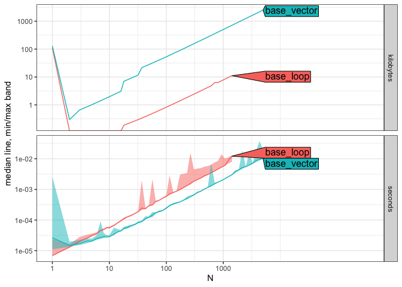
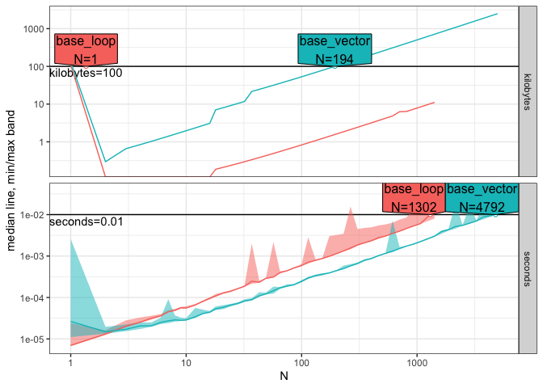
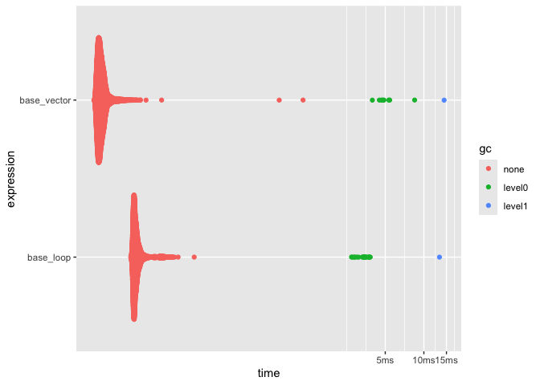
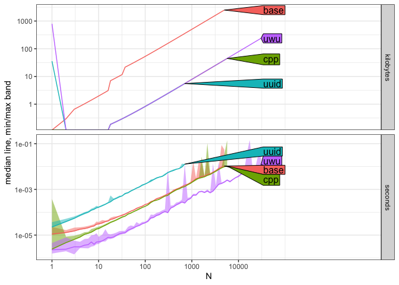
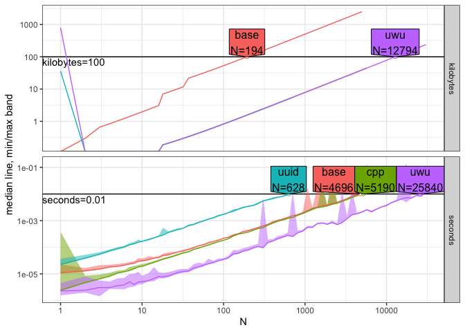
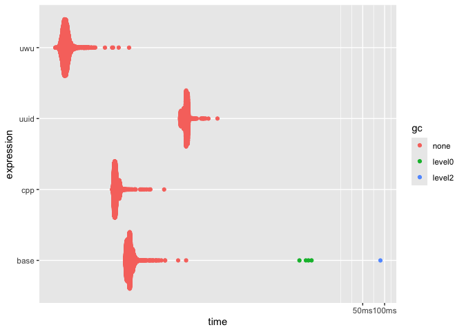

readme
================

## Summary:

Just playing around with different methods in generating uuid v4 in R.
Comparing different benchmarks

- Rcpp implementation based off: <https://github.com/rkg82/uuid-v4>
- package uuid: <https://github.com/s-u/uuid>
- package uwu: <https://github.com/JosiahParry/uwu>
- Base R implementation based off c++ implementation:
  <https://github.com/rkg82/uuid-v4>

## Benchmark:

Initially compare base R implementations.

``` r
subject.size.vec <- unique(as.integer(10^seq(0,6,l=100)))
atime.list <- atime::atime(
  N = subject.size.vec,
  base_loop = uuid_v4_base_loop(N),
  base_vector = uuid_v4_base_vector(N)
)

atime.list
```

    ## atime list with 99 measurements for
    ## base_loop(N=1 to 1417)
    ## base_vector(N=1 to 4977)

``` r
plot(atime.list)
```

    ## Loading required namespace: ggplot2

    ## Loading required namespace: directlabels

    ## Warning in ggplot2::scale_y_log10("median line, min/max band"): log-10 transformation introduced infinite values.
    ## log-10 transformation introduced infinite values.
    ## log-10 transformation introduced infinite values.

<!-- -->

``` r
## Compute and plot asymptotic reference lines:
best.list <- atime::references_best(atime.list)
## Compute and plot data size N for given time/memory.
pred.list <- predict(best.list, seconds=.01, kilobytes=100)
plot(pred.list)
```

    ## Warning in ggplot2::scale_x_log10("N", breaks = meas[, 10^seq(ceiling(min(log10(N))), : log-10 transformation introduced infinite values.
    ## log-10 transformation introduced infinite values.

<!-- -->

``` r
N <- 10
bm <- bench::mark(
  base_loop = uuid_v4_base_loop(N),
  base_vector = uuid_v4_base_vector(N),
  relative = T,
  check = F
)

bm
```

    ## # A tibble: 2 × 6
    ##   expression    min median `itr/sec` mem_alloc `gc/sec`
    ##   <bch:expr>  <dbl>  <dbl>     <dbl>     <dbl>    <dbl>
    ## 1 base_loop    1.94   1.87      1          NaN     1.62
    ## 2 base_vector  1      1         1.87       Inf     1

``` r
plot(bm)
```

    ## Loading required namespace: tidyr

<!-- -->

Will opt for `uuid_v4_base_vector` implementation for base R.

``` r
atime.list <- atime::atime(
  N = subject.size.vec,
  base = uuid_v4_base_vector(N),
  uuid = uuid::UUIDgenerate(n = N),
  uwu = uwu::new_v4(N),
  cpp = uuid_v4_cpp(N)
)


atime.list
```

    ## atime list with 216 measurements for
    ## base(N=1 to 4977)
    ## cpp(N=1 to 5722)
    ## uuid(N=1 to 705)
    ## uwu(N=1 to 30538)

``` r
plot(atime.list)
```

    ## Warning in ggplot2::scale_y_log10("median line, min/max band"): log-10 transformation introduced infinite values.
    ## log-10 transformation introduced infinite values.
    ## log-10 transformation introduced infinite values.

<!-- -->

``` r
## Compute and plot asymptotic reference lines:
best.list <- atime::references_best(atime.list)
## Compute and plot data size N for given time/memory.
pred.list <- predict(best.list, seconds=.01, kilobytes=100)
plot(pred.list)
```

    ## Warning in ggplot2::scale_x_log10("N", breaks = meas[, 10^seq(ceiling(min(log10(N))), : log-10 transformation introduced infinite values.
    ## log-10 transformation introduced infinite values.

<!-- -->

``` r
N <- 10
bm <- bench::mark(
  base = uuid_v4_base_vector(N),
  uuid = uuid::UUIDgenerate(n = N),
  uwu = uwu::new_v4(N),
  cpp = uuid_v4_cpp(N),
  relative = T,
  check = F
)

bm
```

    ## # A tibble: 4 × 6
    ##   expression   min median `itr/sec` mem_alloc `gc/sec`
    ##   <bch:expr> <dbl>  <dbl>     <dbl>     <dbl>    <dbl>
    ## 1 base        9.16   7.61      5.87       Inf      Inf
    ## 2 uuid       52.3   45.9       1          NaN      NaN
    ## 3 uwu         1      1        44.6        NaN      NaN
    ## 4 cpp         6.07   4.87      9.10       NaN      NaN

``` r
plot(bm)
```

<!-- -->

## Summary:

It looks like the package `uwu` has the best performance. However I am
really surprised in the base R implementation. It looks like it out
performs the `uuid` package and only slightly slower than the c++
implementation.

## Session Information:

``` r
sessioninfo::session_info()
```

    ## ─ Session info ───────────────────────────────────────────────────────────────
    ##  setting  value
    ##  version  R version 4.4.1 (2024-06-14)
    ##  os       macOS Sonoma 14.5
    ##  system   aarch64, darwin20
    ##  ui       X11
    ##  language (EN)
    ##  collate  en_US.UTF-8
    ##  ctype    en_US.UTF-8
    ##  tz       Europe/London
    ##  date     2024-08-20
    ##  pandoc   3.3 @ /opt/homebrew/bin/ (via rmarkdown)
    ## 
    ## ─ Packages ───────────────────────────────────────────────────────────────────
    ##  package      * version    date (UTC) lib source
    ##  atime          2024.4.23  2024-04-29 [1] RSPM (R 4.4.0)
    ##  beeswarm       0.4.0      2021-06-01 [1] RSPM (R 4.4.0)
    ##  bench          1.1.3      2023-05-04 [1] RSPM (R 4.4.0)
    ##  cli            3.6.3      2024-06-21 [1] RSPM (R 4.4.0)
    ##  colorspace     2.1-1      2024-07-26 [1] RSPM (R 4.4.0)
    ##  data.table     1.15.4     2024-03-30 [1] RSPM (R 4.4.0)
    ##  digest         0.6.36     2024-06-23 [1] RSPM (R 4.4.0)
    ##  directlabels   2024.1.21  2024-01-24 [1] RSPM (R 4.4.0)
    ##  dplyr          1.1.4      2023-11-17 [1] RSPM (R 4.4.0)
    ##  evaluate       0.24.0     2024-06-10 [1] RSPM (R 4.4.0)
    ##  fansi          1.0.6      2023-12-08 [1] RSPM (R 4.4.0)
    ##  farver         2.1.2      2024-05-13 [1] RSPM (R 4.4.0)
    ##  fastmap        1.2.0      2024-05-15 [1] RSPM (R 4.4.0)
    ##  generics       0.1.3      2022-07-05 [1] RSPM (R 4.4.0)
    ##  ggbeeswarm     0.7.2      2023-04-29 [1] RSPM (R 4.4.0)
    ##  ggplot2        3.5.1      2024-04-23 [1] RSPM (R 4.4.0)
    ##  glue           1.7.0      2024-01-09 [1] RSPM (R 4.4.0)
    ##  gtable         0.3.5      2024-04-22 [1] RSPM (R 4.4.0)
    ##  highr          0.11       2024-05-26 [1] RSPM (R 4.4.0)
    ##  htmltools      0.5.8.1    2024-04-04 [1] RSPM (R 4.4.0)
    ##  knitr          1.48       2024-07-07 [1] RSPM (R 4.4.0)
    ##  labeling       0.4.3      2023-08-29 [1] RSPM (R 4.4.0)
    ##  lattice        0.22-6     2024-03-20 [2] CRAN (R 4.4.1)
    ##  lifecycle      1.0.4      2023-11-07 [1] RSPM (R 4.4.0)
    ##  magrittr       2.0.3      2022-03-30 [1] CRAN (R 4.4.0)
    ##  munsell        0.5.1      2024-04-01 [1] RSPM (R 4.4.0)
    ##  pillar         1.9.0      2023-03-22 [1] CRAN (R 4.4.0)
    ##  pkgconfig      2.0.3      2019-09-22 [1] CRAN (R 4.4.0)
    ##  profmem        0.6.0      2020-12-13 [1] RSPM (R 4.4.0)
    ##  purrr          1.0.2.9000 2024-07-02 [1] local
    ##  quadprog       1.5-8      2019-11-20 [1] RSPM (R 4.4.0)
    ##  R6             2.5.1      2021-08-19 [1] CRAN (R 4.4.0)
    ##  Rcpp           1.0.13     2024-07-17 [1] RSPM (R 4.4.0)
    ##  rlang          1.1.4      2024-06-04 [1] RSPM (R 4.4.0)
    ##  rmarkdown      2.28       2024-08-17 [1] RSPM (R 4.4.0)
    ##  rstudioapi     0.16.0     2024-03-24 [1] RSPM (R 4.4.0)
    ##  scales         1.3.0      2023-11-28 [1] RSPM (R 4.4.0)
    ##  sessioninfo    1.2.2      2021-12-06 [1] RSPM (R 4.4.0)
    ##  tibble         3.2.1      2023-03-20 [1] CRAN (R 4.4.0)
    ##  tidyr          1.3.1      2024-01-24 [1] RSPM (R 4.4.0)
    ##  tidyselect     1.2.1      2024-03-11 [1] RSPM (R 4.4.0)
    ##  utf8           1.2.4      2023-10-22 [1] RSPM (R 4.4.0)
    ##  uuid           1.2-1      2024-07-29 [1] RSPM (R 4.4.0)
    ##  uwu            0.0.0.9000 2024-08-20 [1] Github (josiahparry/uwu@d3bd974)
    ##  vctrs          0.6.5      2023-12-01 [1] RSPM (R 4.4.0)
    ##  vipor          0.4.7      2023-12-18 [1] RSPM (R 4.4.0)
    ##  withr          3.0.1      2024-07-31 [1] RSPM (R 4.4.0)
    ##  xfun           0.47       2024-08-17 [1] RSPM (R 4.4.0)
    ##  yaml           2.3.10     2024-07-26 [1] RSPM (R 4.4.0)
    ## 
    ##  [1] /Users/dyfanjones/Library/R/arm64/4.4/library
    ##  [2] /Library/Frameworks/R.framework/Versions/4.4-arm64/Resources/library
    ## 
    ## ──────────────────────────────────────────────────────────────────────────────
